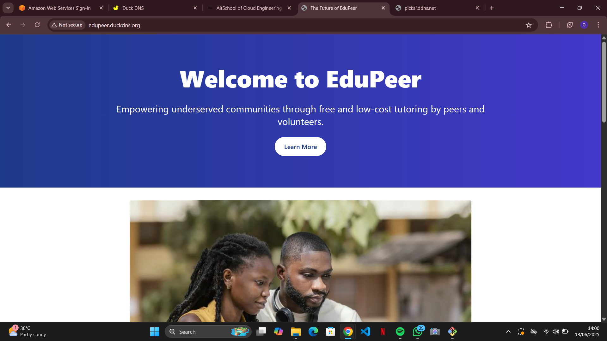

Objective
Provision and deploy a dynamic landing page on a cloud-based Linux server to demonstrate web server setup, networking, and basic security configuration.
 Project Summary

- *Name*: Teniola Agboola
- *Role*: Lead Cloud Engineer
- *Project Title*: The Future of AI-Powered Learning
- *Pitch*:  
  EduPeer is an AI-driven learning platform connecting students to personalized peer tutors in real-time. With AI-generated content support and adaptive feedback systems, we’re revolutionizing how students study and succeed.
- *Bio*:  
  Aspiring Cloud Engineer at AltSchool. Proficient in Linux, Nginx, and web hosting. Currently building full-stack prototypes and improving cloud infrastructure skills.

 Server & Web Stack

| Component | Details |
|----------|---------|
| *Cloud Provider* | AWS EC2 |
| *OS* | Ubuntu 22.04 |
| *Web Server* | Nginx |
| *Domain (Free)* | DuckDNS (edupeer.duckdns.org) |
| *Static Site* | HTML, CSS (with some animation) |
| *Security* | Ports 80 (HTTP) and 443 (HTTPS) allowed |
## 🌍 Hosted File
- `index.html` is served at root via Nginx from `/var/www/html`

Access the Live Site

> *URL*: http://edupeer.duckdns.org  
> (Note: HTTPS setup was attempted but failed due to DNS verification issues with DuckDNS.)
> *Public IP address where the page is hosted*: http://13.43.94.158/

## Screenshot

 

